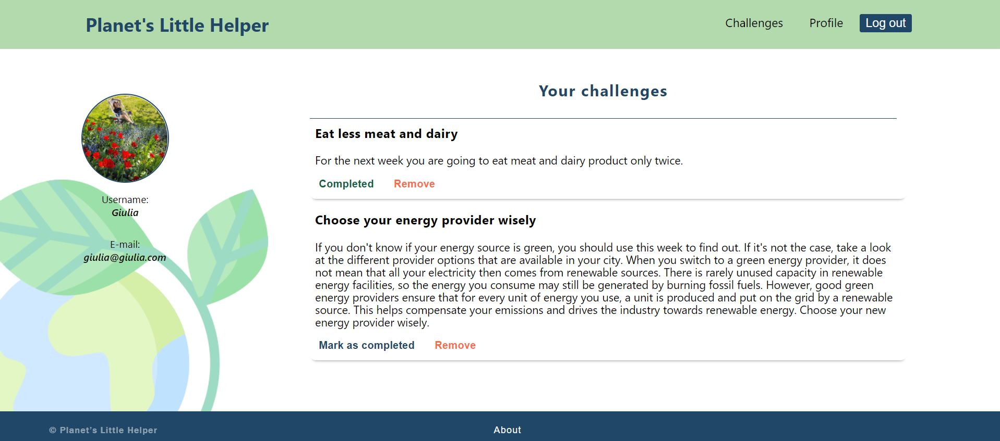
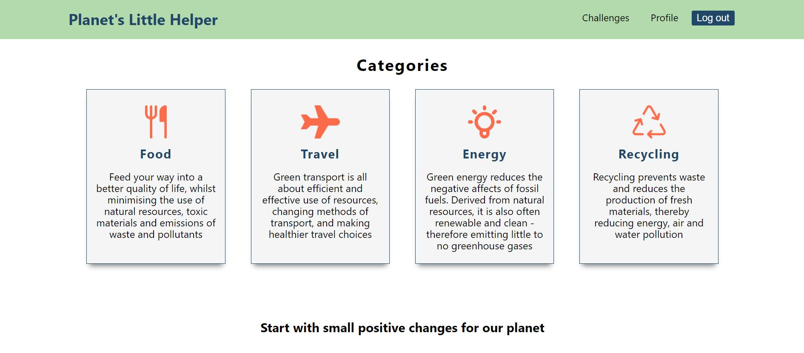
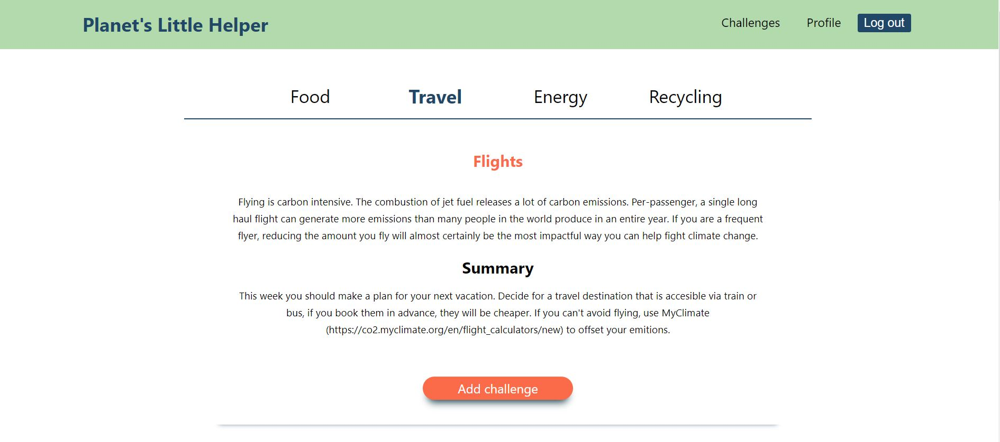

## Planet Little Helper

This app was created as final project for TechLabs Berlin. 

The idea of the project was to come up with a web application that helps their users to change their habits for the better and become more environmentally conscious. Our app is aimed at everyone who would like to contribute to the cause, and it offers simple challenges, because we believe that every little help counts and the more we keep adding it up, the better chance we have to see a real change for our planet in the future. 

The project  that we are presenting is a web application, where a user can create an account, browse among our challenges, add them, toggle them as complete or remove them. 

<i>Landing page</i>

<i>Profile page</i>

<i>Categories page</i>

<i>Challenges page</i>

# The Team

<ul>
<li>Btari - Data Science</li>
<li>Donara - UI/UX</li>
<li>Ina - Front end development</li>
<li>Giulia - Back end development</li>
<li>Ori - UI/UX</li>
<li>Sam - UI/UX</li>
</ul>

## Todo:

Back end deployment

If you want to take a look at the front end part, please visit <a href="https://planetslittlehelper.netlify.app/">Planet's Little Helper.</a>:

