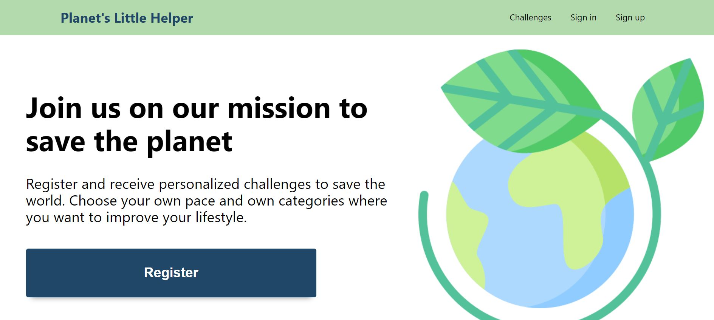

## Planet Little Helper

This app was created as final project for TechLabs Berlin. 

The idea of the project was to come up with a web application that helps their users to change their habits for the better and become more environmentally conscious. Our app is aimed at everyone who would like to contribute to the cause, and it offers simple challenges, because we believe that every small action will help our chances of a greater positive impact on the future. 

The project  that we are presenting is a web application, where a user can create an account, browse among our challenges, add them, toggle them as complete or remove them. 

<i>Landing page</i>

<i>Profile page</i>

<i>Categories page</i>

<i>Challenges page</i>

# How to run it

Clone the repo, install dependencies for client and server (example: cd client, yarn install).
Create .env file in both client and server folders and add necessary variables (since the project is public we will not disclose them here, but please ask us if you want to run this project on your machine.)

Finally run yarn client-start in the client folder and yarn server-start in the server folder. 

# The Team

<ul>
<li>Btari - Data Science</li>
<li>Donara - UI/UX</li>
<li>Ina - Front end development</li>
<li>Giulia - Back end development</li>
<li>Ori - UI/UX</li>
<li>Sam - UI/UX</li>
</ul>

If you want to take a look at our project, please visit <a href="https://planetslittlehelper.netlify.app/">Planet's Little Helper.</a>

