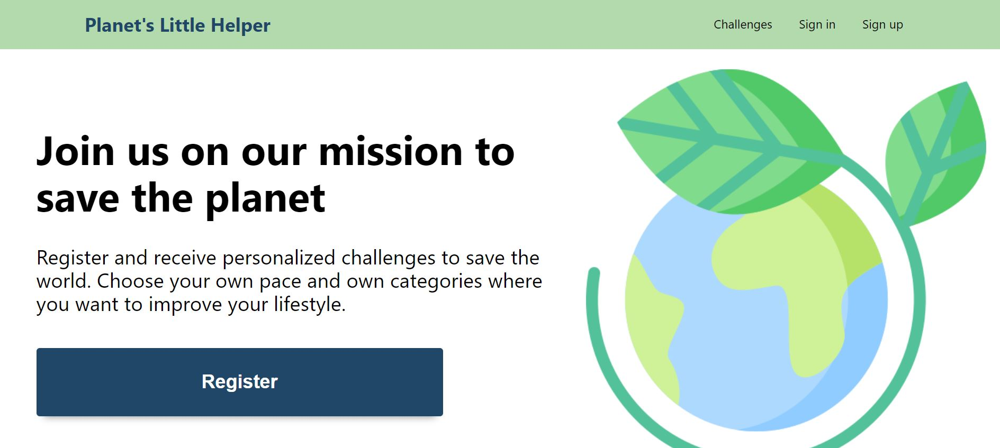
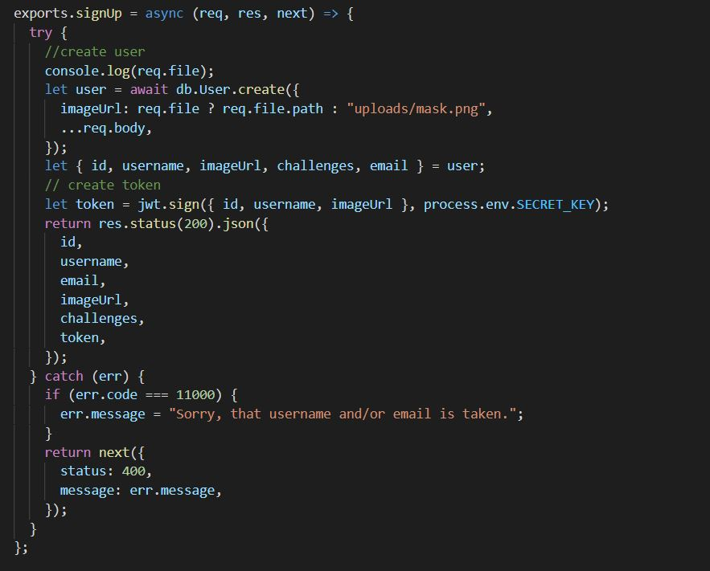
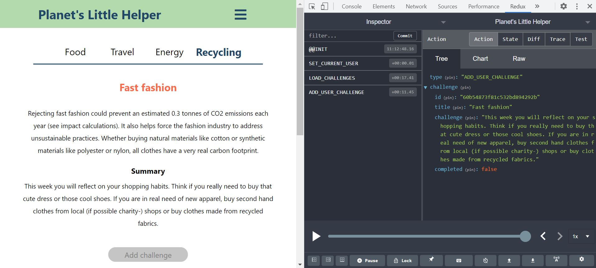
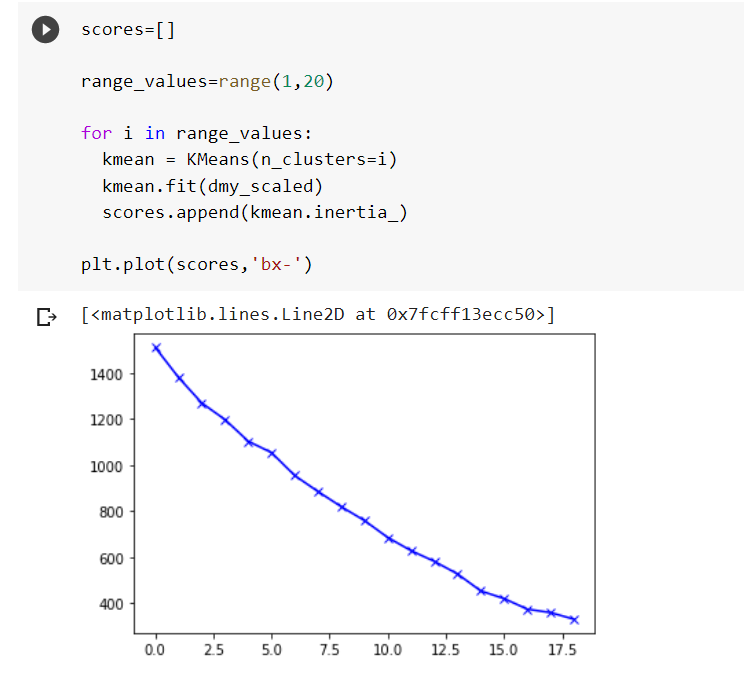
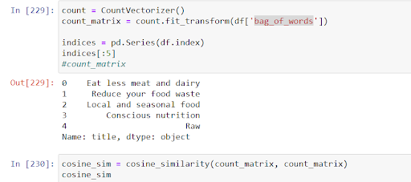

# How we build Planet’s Little Helper

[Introduction](#introduction)
 
[UI/UX](#ui-ux)
 
[Web Development](#web-development)
 
[Data Science](#data-science)
 
[The Team](#the-team)
 
[Conclusions](#conclusions)
 

## Introduction 

Planet’s Little Helper is the result of the work of Btari, Donara, Ina, Giulia, Ori and Sam, six passionate students at TechLabs, Berlin.

The idea of the project was to come up with a web application that helps their users to change their habits for the better and become more environmentally conscious. Our app is aimed at everyone who would like to contribute to the cause, and it offers simple challenges, because we believe that every little help counts and the more we keep adding it up, the better chance we have to see a real change for our planet in the future. 

The project  that we are presenting is a web application, where a user can create an account, browse among our challenges, add them, toggle them as complete or remove them. 

In this article we explained the process of building our app, the roadblocks we faced and more details about the project. 

## UI UX 

First task for the UX design team was to identify if there is a need for such a platform, who our users are, and what they want from the platform. We have created a survey to get insights on how much people are aware of the connection between environmental issues and their actions and whether they are willing to change their actions or take extra actions in order to make a positive impact on the environment. The questionnaire also included questions concerning environmental online platforms; what platforms they use, if not using any, whether they will be interested in using one and what are the reasons for using such platforms. Demographic questions were also included to help us create more precise user persona and user story. The survey was created via Google Forms.

After collecting the data, we started to work on creating user personas and user stories. However, we also started to do first sketches and wireframes right away because of the time pressure. After finalising the collected data, it was easier for us to understand the user flow through the platform, which helped a lot with sketches. For prototyping we used Figma.
Even though everyone on the team (not only UX) had so many ideas of various features of the platform, we separated the main ones, which will be feasible within the limited timeframe and the team capabilities. The main features were chosen to be receiving challenges, personalisation of challenges when signed in and user profile, where the user can complete or delete the challenge.
After many options with the design and functionality of the platform and many team meetings, 1 week before the deadline we finalised everything, chose the color palette and did user testing. As we tried to keep the simple and understandable design, the testing went very well and only a few minor changes were required.

## Web Development 

We decided to create our web app with the MERN stack (MongoDB, Express, React, Node.js) and we used Python for the machine learning part. We all had little or no experience with these technologies, but we decided to venture out and learn something new while building our project. 

### The building

We created the initial React project by using create-react-app. CRA simplifies the process of setting up a new application, so we did not have to think too much about the configuration and were able to focus on coding. 

CRA does not create the backend, as we decided to use Node.js, we created the backend folder (called server), init the node application and installed the necessary dependencies. 

Another decision we made almost immediately was to use MongoDB’s Atlas cloud platform to manage the database. It did not take much to set it up and it offered a free plan that was more than enough for our needs. 

### The back end

The first thing we did was to create a Cluster on MongoDB Atlas, so that we could receive the connection string to use in our application. 
Back into the project we started by creating our server with Express, then thanks to a library called Mongoose we created our connection with MongoDB Atlas, using the connection string we had just received. 

In our database, we decided to have two collections: one to store all the challenges and one for our users' accounts, so we defined our challenge and user schemas using Mongoose. 

As we previously created a js file with an array containing all our challenges, we imported it and used the Mongoose “insertMany” method to populate our collection with challenges. That collection was ready to be used.

We then decided to start with user’s authorization/authentication, but before that we wrote a generic error handling middleware that returns a nicely formatted object with a message that we can customize according to the specific situation. 

Now we could finally work on signing up/logging in our users. For that we installed 2 more dependencies: BCrypt and jwt. We used BCrypt to salt the user’s plaintext password and to re-compare it when a user logs in. The salt is a bit of random data that is added to a user’s password. The salted password is then run through a hashing function, a one-way process, that makes it is not possible to dissect the hash to determine the original password. 

After that we created the functions to sign up/log in users. When a user signs up, we create a token using the jwt module and a secret key (that we came up with and that we saved in our .env file). We then store this token in our database and we use it to authorize certain operations, like logging in or making requests for a specific account. 

When a user creates their accounts, they can also add a profile picture, meaning that we receive a response that combines text and a binary file, in order to tackle this issue, we decided to use a package called multer, a middleware for handling multipart/form-data.

After that we moved on and created the functionalities to add/remove and toggle challenges as completed for each account. 

During this process, since we did not have a UI yet, we tested our requests using Postman. 

### The front end

The first thing we did was to create the project structure. We created our pages and then we started working on routing using react-router-dom. For the challenges page we used dynamic routes, like that we did not have to hard code the challenge's category url and we could add more categories in the future. We then used the url parameter (the category itself) to filter through our challenges and display the right challenges by category. 

Since we almost immediately realized that we needed to have some state, like the challenges and the current user details, available in more parts of our application, we decided to use redux to handle it. Having the current user available globally, we could for example show the correct info for each user and show/hide some routes or buttons to the user if it was authenticated or not. 

Last but not least we put our styling skills in action. Every page was styled with CSS and it's technology Flexbox. Regular meetings were taking place between the UX team and the Web developers in order to ensure good communication and understanding about each others work and skills. The UX team had great ideas which weren't always doable with the current knowledge and experience of the Front end developer. This was discussed and changes were made accordingly. After agreeing on the final design last touches were made until the presentation day.

Last but not least we put our styling skills in action. Every page was styled with CSS and it's technology Flexbox. Regular meetings were taking place between the UX team and the Web developers in order to ensure good communication and understanding about each others work and skills. The UX team had great ideas which weren't always doable with the current knowledge and experience of the Front end developer. This was discussed and changes were made accordingly. After agreeing on the final design last touches were made until the presentation day.

This journey was a great experience. We all learned a lot. It wasn't always easy and we are proud of the result of our work. Thank you for taking the time to read our blog! Now let's make the world a better place together!

## Data Science 

### Demand

Nowadays, many people speak about wanting to be more eco-friendly, yet that is harder done than said. In order to achieve our goal, we had to dig deep into the why. So initially it can be seen that the main problem that hinders people from changing their habits into more environmentally friendly is the time/energy required to find the information about what activities that can be done to achieve the  behaviour. So logically, if the list of activities are provided, this would be a big help for the people to act more consciously, right? That is exactly the reason why the Planet’s Little Helper was initiated. 

### Task
The WebDev team has done a great job providing the feature where the user can choose their option of challenges. From the Data Science side, the task assigned would be to cluster the data of potential users that has been collected and to give recommendations based on their chosen challenges.

### Process
In order to provide suitable challenges for the users, the market has to be analysed from the data collected beforehand. The method used to analyse certain relationships between potential users is by using KMeans model. The Elbow method also helped to decide the optimal number of clusters along the way. And as the result is that, it is the most optimal when the users are divided into 4 groups. 

That is also why the Planet’s Little Helper team decided on providing the challenges in four different categories which are: Transport and Travel, Food, Energy; Recycling.

As for the recommender function, the DS team has decided to achieve the functionality with the help of Count Vectorizer for text processing. Each question stored in the Planet’s Little Helper’s database is also provided with other information like category and challenge description. Those information are combined in a “bag of words” and the DS team utilizes the Count Vectorizer to create a machine learning model that finds the similarities between the challenges that are already chosen by the user and the challenges available. So at the end, a list of challenge recommendations can be created. 
 

# The team 

<ul>
<li>Btari - Data Science</li>
<li>Donara - UI/UX</li>
<li>Ina - Front end development</li>
<li>Giulia - Back end development</li>
<li>Ori - UI/UX</li>
<li>Sam - UI/UX</li>
</ul>

# Conclusions 

This journey was a great experience. We all learned a lot. It wasn't always easy and we are proud of the result of our work. Thank you for taking the time to read our blog! Now let's make the world a better place together!

